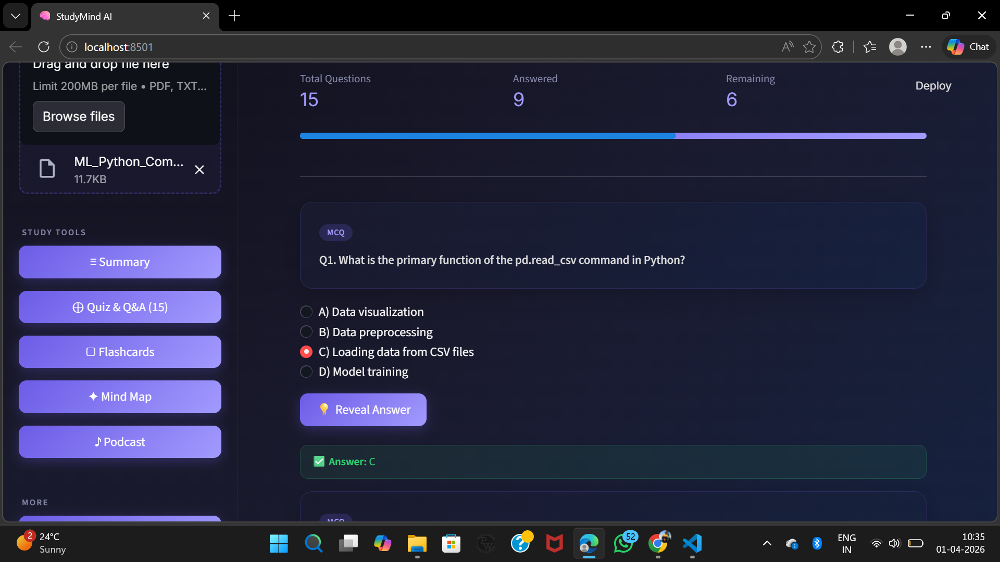
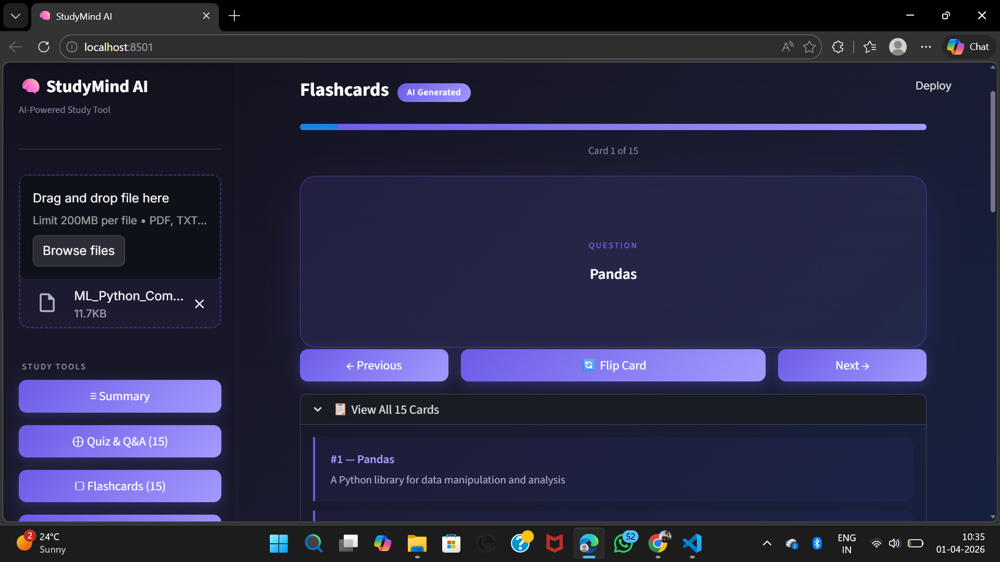
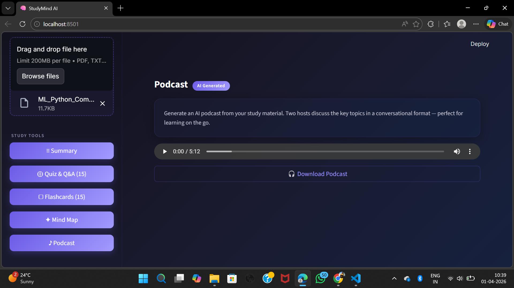

<div align="center">

# 🧠 SmartStudy AI

### AI-Powered Study Tool — Turn Any PDF into Summary, Quiz, Flashcards, Mind Map & Podcast

[](https://python.org)
[](https://streamlit.io)
[](https://console.groq.com)
[](https://groq.com)
[](LICENSE)
[]()

**Upload any PDF — AI instantly generates a structured summary, quiz questions, flashcards, a visual mind map, and an audio podcast.**

[Features](#-features) · [Screenshots](#-screenshots) · [Installation](#-installation) · [Usage](#-usage) · [Project Structure](#-project-structure) · [Tech Stack](#-tech-stack) · [Roadmap](#-roadmap)

</div>

---

## 🎯 What is SmartStudy AI?

**SmartStudy AI** is a free, open-source Python application built for students. Upload any academic PDF — a textbook chapter, lecture notes, or research paper — and the AI automatically produces five types of study content:

| Output | What You Get |
|---|---|
| 📋 **Smart Summary** | Structured notes with overview, key topics, definitions, and formulas |
| ❓ **Quiz & Q&A** | 15 auto-generated questions — MCQ, Short Answer, Fill in Blank, True/False |
| 🗂️ **Flashcards** | 15 revision cards with the question on the front and the answer on the back |
| 🧩 **Mind Map** | Visual topic hierarchy rendered with Graphviz |
| 🎙️ **Podcast** | Two-host conversational audio in NotebookLM style |

> **100% Free** — Powered by the **Groq API free tier** running **Llama 3.3 70B**. No credit card required.

---

## 📸 Screenshots

> Real session using `ML_Python_Commands_Cheatsheet.pdf` — 4 pages, 822 words.

---

### 1. 📋 AI Summary — Overview Tab


The **Summary page** is the first screen after uploading a PDF. Key things visible:

- **File info bar** — `ML_Python_Commands_Cheatsheet.pdf · 4 pages · 822 words`
- **Topic Paragraph** — AI-generated 3-5 sentence overview of the entire document content
- **Three tabs** — Overview, Definitions, Formulas — each showing a different type of structured content
- **Export button** (top right) — downloads the full summary as a JSON file
- **Sidebar navigation** — all 5 study tools visible: Summary, Quiz & Q&A (15), Flashcards (15), Mind Map, Podcast
- **Dev Roadmap & Add Feature** buttons at the bottom of the sidebar

The AI correctly identified that the PDF covers Python ML commands across 10 sections — data loading, preprocessing, feature engineering, model training, evaluation, and deployment.

---

### 2. ❓ Quiz & Q&A — Interactive Mode



The **Quiz page** with 15 live interactive questions:

- **Stats bar** at top — Total Questions: **15**, Answered: **9**, Remaining: **6**, with a progress bar
- **MCQ badge** label on each question card
- **Question shown** — *"What is the primary function of the pd.read_csv command in Python?"*
- **4 radio button options** — A) Data visualization, B) Data preprocessing, C) Loading data from CSV files, D) Model training
- **User selected C)** — marked with filled radio button
- **Reveal Answer button** — clicked → shows green `✅ Answer: C` card below the options
- **On-demand generation** — quiz generates only when the button is clicked, saving API calls

---

### 3. 🗂️ Flashcards — Flip Card Mode



The **Flashcards page** with 15 interactive revision cards:

- **Blue progress bar** at top — fully filled showing Card 1 of 15
- **Card counter** — *"Card 1 of 15"* shown below the bar
- **Front side of card** — shows label `QUESTION` and the term **"Pandas"** in large bold text
- **Three navigation buttons** — `← Previous`, `🔄 Flip Card` (reveals answer), `Next →`
- **"View All 15 Cards"** expandable section below — quick list showing:
  - `#1 — Pandas: A Python library for data manipulation and analysis`
  - (and 14 more cards below)

---

### 4. 🧩 Mind Map — Visual Hierarchy


The **Mind Map page** with full Graphviz-rendered topic tree:

- **Top section** — actual visual Graphviz diagram showing the complete topic hierarchy as a tree
- **Root node** — `Python ML` at the top center
- **7 branch nodes** — Data Loading, Data Prep, Feature Eng, Model Train, Model Eval, Model Build, Model Saving
- **Leaf nodes** under each branch:
  - Data Loading → CSV Load, SQL Load, Data Inspection
  - Data Prep → Handle Missing, Remove Duplicates, Encode Categorical
  - Feature Eng → Create Features, Select Features, Transform Features
  - And more for each branch...
- **"View Hierarchy as List"** expandable section — same structure as indented text:
  - `Python ML` (root, shown as purple banner)
  - `● Data Loading` → `○ CSV Load`, `○ SQL Load`, `○ Data Inspection`
  - `● Data Prep` → `○ Handle Missing`, `○ Remove Duplicates`, `○ Encode Categorical`

---

### 5. 🎙️ Podcast — Audio Player



The **Podcast page** with a fully generated and playable audio file:

- **"AI Generated" badge** next to the Podcast heading
- **Description text** — *"Generate an AI podcast from your study material. Two hosts discuss the key topics in a conversational format — perfect for learning on the go."*
- **Native browser audio player** — shows `0:00 / 5:12`, with play button, seek bar, volume, and options
- **"Download Podcast" button** — saves the `.mp3` file locally for offline listening (gym, commute, etc.)

The podcast was generated from the ML Python cheatsheet — Host A (curious student) asked questions about Pandas, NumPy, and sklearn, while Host B (expert) explained with examples. Total generation time ~3-4 minutes including Groq script + Kokoro TTS audio rendering for all 24 turns.

---

## ✨ Features

### 📋 Module 1 — AI Summarization
- Extracts text from any text-based PDF using **PyMuPDF (fitz)**
- Sends extracted text to **Groq API (Llama 3.3 70B)** for summarization
- Returns a structured JSON summary containing:
  - **Overview** — 3 to 5 sentence introduction to the topic
  - **Key Topics** — hierarchical bullet list with descriptions
  - **Definitions** — important terms explained concisely
  - **Formulas** — preserved exactly as written, never simplified
  - **Takeaway** — 2 to 3 sentence study conclusion
- Automatic chunking for large documents — handles 200+ page PDFs
- Chunk-then-merge strategy for coherent final output

### ❓ Module 2 — Quiz & Q&A Generation
- Generates 15 questions across 4 types:
  - **MCQ** — 4 options per question, correct answer marked with explanation
  - **Short Answer** — question paired with a model answer
  - **Fill in the Blank** — key term removed from a statement + answer key
  - **True / False** — statement with correct verdict and one-line reasoning
- Interactive mode in the UI — select answers and reveal correct ones
- Progress bar tracking how many questions you have answered
- JSON validation and auto-retry on malformed API output
- Export the full quiz with answer key as a `.txt` file

### 🗂️ Module 3 — Flashcards
- Generates 15 study flashcards from the document summary
- **Front side** — question or key term to recall
- **Back side** — detailed answer or definition
- Card flip interaction in the Streamlit UI
- Navigate with Previous and Next buttons + "View All" bulk list

### 🧩 Module 4 — Mind Map
- Generates a structured topic hierarchy using **Graphviz**
- Root node = main document topic
- Branch nodes = major subtopics
- Leaf nodes = supporting details and facts
- Inline visual diagram + collapsible text hierarchy list
- Exports as a downloadable PNG image

### 🎙️ Module 5 — Podcast Generation
- Generates a natural **two-host dialogue script** (NotebookLM style)
- **Host A** — a curious student asking probing questions
- **Host B** — a knowledgeable expert explaining with examples
- Script produced by Groq API (Llama 3.3 70B for natural conversation quality)
- Targets 25 to 30 dialogue turns covering all key topics
- Kokoro TTS voices each line with distinct voices
- pydub merges all clips with 400ms natural pauses
- Output: downloadable `.mp3` file (5-10 minutes)

### 🖥️ Streamlit Web UI
- Premium dark-themed interface built with custom CSS
- Sidebar navigation — Summary, Quiz, Flashcards, Mind Map, Podcast
- Accepts PDF, TXT, and MD file uploads (up to 200MB)
- Live progress indicator during AI processing
- Download buttons for every generated output
- On-demand generation — each tool generates only when you click
- Dev Roadmap + Add Feature quick-access buttons in sidebar

---

## 🚀 Installation

### Prerequisites

- Python 3.10 or newer
- Groq API key — [Get your free key here](https://console.groq.com) (no credit card required)
- Graphviz installed at the system level (required for mind map)

### Step 1 — Clone the Repository

```bash
git clone https://github.com/ranjan781/SmartStudy.git
cd SmartStudy
```

### Step 2 — Create a Virtual Environment

```bash
# Windows
python -m venv venv
venv\Scripts\activate

# macOS / Linux
python3 -m venv venv
source venv/bin/activate
```

### Step 3 — Install Python Dependencies

```bash
pip install -r requirements.txt
```

`requirements.txt` contents:

```
pymupdf>=1.24.0
streamlit>=1.30.0
groq>=0.9.0
python-dotenv>=1.0.0
graphviz>=0.20.0
reportlab>=4.0.0
```

### Step 4 — Install Graphviz at System Level

```bash
# Windows (using Chocolatey)
choco install graphviz

# macOS
brew install graphviz

# Ubuntu / Debian
sudo apt install graphviz
```

> **Why system-level?** The Python `graphviz` package is just a wrapper — the actual rendering engine must be installed separately.

### Step 5 — Configure Your API Key

Create a `.env` file in the project root directory:

```
GROQ_API_KEY=your_groq_api_key_here
```

> **How to get a Groq API key:**
> 1. Go to [console.groq.com](https://console.groq.com)
> 2. Sign up with Google or email
> 3. Navigate to **API Keys** → **Create New Key**
> 4. Copy and paste it into your `.env` file
>
> Free tier gives you **14,400 requests/day** and **30 requests/minute** — more than enough for any student.

---

## 💻 Usage

### Option A — Streamlit Web UI (Recommended)

```bash
streamlit run app.py
```

Your browser will open at `http://localhost:8501`.

1. Upload a PDF from the left sidebar
2. Click **"Process Document"**
3. Wait for the AI to generate the summary (10 to 30 seconds)
4. Navigate to Quiz, Flashcards, Mind Map, or Podcast from the sidebar
5. Click **"Generate"** on each page to produce that content on demand
6. Use the download buttons to save your outputs

### Option B — Command Line (CLI)

```bash
# Summary only
python main.py "path/to/your/chapter.pdf"

# Summary + Quiz
python main.py "path/to/your/chapter.pdf" --quiz

# Summary + Quiz + Podcast
python main.py "path/to/your/chapter.pdf" --quiz --podcast
```

All output files are saved automatically to the `outputs/` folder.

---

## 🗂️ Project Structure

```
SmartStudy/
│
├── app.py                    # Main Streamlit web application
├── main.py                   # CLI entry point
│
├── modules/
│   ├── extractor.py          # PDF text extraction — PyMuPDF
│   ├── summarizer.py         # AI summarization — Groq API
│   ├── quiz_gen.py           # Quiz generation — Groq API
│   ├── flashcard_gen.py      # Flashcard generation — Groq API
│   ├── mindmap_gen.py        # Mind map generation — Graphviz
│   ├── podcast_gen.py        # Podcast script + Kokoro TTS + pydub
│   └── exporter.py           # File export — TXT, JSON, PDF via ReportLab
│
├── prompts/
│   ├── summary_prompt.txt    # System prompt for summarization
│   ├── quiz_prompt.txt       # System prompt for quiz questions
│   ├── flashcard_prompt.txt  # System prompt for flashcards
│   ├── mindmap_prompt.txt    # System prompt for mind map hierarchy
│   └── podcast_prompt.txt    # System prompt for podcast dialogue
│
├── screenshots/
│   ├── summary.png           # AI Summary page
│   ├── quiz.png              # Quiz & Q&A interactive mode
│   ├── flashcards.png        # Flashcard flip UI
│   ├── mindmap.png           # Graphviz mind map diagram
│   └── podcast.png           # Podcast audio player
│
├── outputs/                  # All generated files land here
│   ├── summary.json
│   ├── quiz.txt
│   └── podcast.mp3
│
├── test_extractor.py         # Test — PDF text extraction
├── test_gemini.py            # Test — Groq API connection
├── test_podcast.py           # Test — Podcast script generation
│
├── system_response.md        # Sample AI responses for development reference
├── .gitignore
├── requirements.txt
└── README.md
```

---

## 🔧 Tech Stack

| Layer | Tool | Version | Purpose |
|---|---|---|---|
| **PDF Extraction** | PyMuPDF (fitz) | 1.24+ | Extract and clean text from PDF pages |
| **AI / LLM** | Groq API | 0.9+ | Fast inference for all AI features |
| **LLM Models** | Llama 3.3 70B + Llama 3.1 8B | — | Groq-hosted open-source models |
| **TTS** | Kokoro TTS (kokoro-onnx) | — | Text-to-speech for podcast audio |
| **Audio** | pydub + ffmpeg | — | Merge voice clips into final .mp3 |
| **UI Framework** | Streamlit | 1.30+ | Web interface with custom dark theme |
| **Mind Map** | Graphviz | 0.20+ | Topic hierarchy diagram rendering |
| **PDF Export** | ReportLab | 4.0+ | Generate downloadable quiz PDFs |
| **Environment** | python-dotenv | 1.0+ | Secure API key loading from `.env` |
| **Language** | Python | 3.10+ | Core application runtime |

### Model Selection Strategy

| Module | Groq Model | Why This Model |
|---|---|---|
| Summarization | `llama-3.3-70b-versatile` | Best at structured extraction and reasoning |
| Quiz Generation | `llama-3.1-8b-instant` | Fast enough, good at formatted JSON output |
| Flashcards | `llama-3.1-8b-instant` | Simple Q&A pairs, speed is the priority |
| Mind Map | `llama-3.3-70b-versatile` | Better hierarchical reasoning |
| Podcast Script | `llama-3.3-70b-versatile` | Natural and engaging conversational dialogue |

### Why Groq Over Other Providers?

| Factor | Groq | OpenAI | Google Gemini |
|---|---|---|---|
| Cost | Free tier | Paid only | Free tier |
| Speed | Fastest (LPU) | Medium | Medium |
| Daily limit | 14,400 req/day | — | 1,500 req/day |
| Card required | No | Yes | No |
| Model quality | Llama 3.3 70B | GPT-4o | Gemini 1.5 |

---

## 📊 End-to-End Data Flow

```
User uploads PDF
        │
        ▼
[extractor.py]
  PyMuPDF reads all pages
  Cleans headers, footers, page numbers, whitespace
  Chunks text if > 3000 tokens
        │
        ▼
[summarizer.py]
  Each chunk → Groq API (Llama 3.3 70B)
  Partial summaries → final merge prompt
  Returns structured JSON: overview, topics, definitions, formulas, takeaway
        │
        ├─────────────────────┬─────────────────────┬─────────────────────┐
        ▼                     ▼                     ▼                     ▼
[quiz_gen.py]         [flashcard_gen.py]    [mindmap_gen.py]     [podcast_gen.py]
Groq → 15 questions   Groq → 15 cards       Groq → hierarchy     Groq → dialogue JSON
JSON with answers     front + back pairs    Graphviz → PNG       Kokoro TTS → .mp3
        │                     │                     │                     │
        └─────────────────────┴─────────────────────┴─────────────────────┘
                                        │
                                        ▼
                              [exporter.py]
                   Saves summary.json, quiz.txt, mind_map.png, podcast.mp3
                   to the outputs/ folder
```

---

## 🧪 Running Tests

Three test scripts verify that each core component is working:

```bash
# Verify PDF text extraction is working
python test_extractor.py

# Verify Groq API key and connection
python test_gemini.py

# Verify podcast script generation
python test_podcast.py
```

Run these first whenever you set up on a new machine or debug an API issue.

---

## ⚙️ Configuration Guide

### Switch Between Groq Models

In any module file, change the model string:

```python
from groq import Groq
client = Groq()

response = client.chat.completions.create(
    model="llama-3.3-70b-versatile",  # Change this line
    # model="llama-3.1-8b-instant",   # Faster but slightly lower quality
    messages=[{"role": "user", "content": your_prompt}]
)
```

### Adjust Chunk Size for Large PDFs

In `modules/extractor.py`:

```python
MAX_CHARS = 12000  # Roughly 3000 tokens — increase if your PDFs are very long
```

### Change the Number of Questions or Cards

Edit `prompts/quiz_prompt.txt` or `prompts/flashcard_prompt.txt` directly — no Python code change required.

### Add Rate Limit Protection

If you hit Groq rate limits, add this between API calls:

```python
import time
time.sleep(2)  # 2 second pause between calls
```

---

## 🐛 Common Errors and Fixes

| Error | Likely Cause | Fix |
|---|---|---|
| `GROQ_API_KEY not found` | `.env` file missing or misnamed | Create `.env` in the project root with your key |
| `No module named 'groq'` | groq not installed | `pip install groq` inside your venv |
| `AuthenticationError` | Invalid or expired API key | Generate a new key at console.groq.com |
| `RateLimitError` | Too many requests per minute | Add `time.sleep(2)` between Groq calls |
| `graphviz.backend.execute.ExecutableNotFound` | Graphviz not installed at system level | Run `brew install graphviz` or `apt install graphviz` |
| `ModuleNotFoundError: fitz` | PyMuPDF not installed | Run `pip install pymupdf` |
| `JSONDecodeError` on quiz output | LLM returned text with markdown fences | The retry logic in `quiz_gen.py` handles this automatically |
| Empty extraction from PDF | Scanned or image-only PDF | OCR is not supported in v1 — use text-based PDFs only |
| Streamlit port already in use | Another process on port 8501 | Run `streamlit run app.py --server.port 8502` |

---

## 🗺️ Roadmap

### v1.0 — Current Release ✅
- [x] PDF text extraction with PyMuPDF
- [x] AI summarization via Groq + Llama 3.3
- [x] Quiz generation — 4 question types
- [x] Flashcard generation with flip interaction
- [x] Mind map visualization with Graphviz
- [x] Podcast script + Kokoro TTS + pydub .mp3
- [x] Dark-themed Streamlit UI with custom CSS
- [x] CLI support with `--quiz` `--podcast` flags
- [x] File export — JSON, TXT, MP3, PDF

### v2.0 — Planned 🚧
- [ ] **OCR support** — handle scanned and image-only PDFs using pytesseract
- [ ] **Multi-PDF RAG** — build a personal knowledge base across multiple documents
- [ ] **Interactive quiz mode** — live scoring, countdown timer, wrong answer explanations
- [ ] **Anki export** — generate `.apkg` flashcard files for spaced repetition
- [ ] **Hindi voice support** — multilingual podcast output using regional TTS voices
- [ ] **YouTube transcript ingestion** — study from video lectures, not just PDFs
- [ ] **Progress dashboard** — track quiz scores over time, identify weak topics
- [ ] **Telegram bot interface** — send a PDF, receive summary and quiz directly on mobile

---

## 🤝 Contributing

Contributions are welcome. To add a feature or report a bug:

1. Fork this repository
2. Create a feature branch — `git checkout -b feature/your-feature`
3. Make your changes and commit — `git commit -m "Add: description of change"`
4. Push your branch — `git push origin feature/your-feature`
5. Open a Pull Request with a clear description

Please write clean, commented code and test your changes before submitting.

---

## 👨‍💻 Author

**Ranjan Yadav** — Solo student project

- GitHub: [@ranjan781](https://github.com/ranjan781)
- Repository: [SmartStudy](https://github.com/ranjan781/SmartStudy)

---

## 📄 License

This project is licensed under the **MIT License** — free to use, modify, and distribute.

---

<div align="center">

**Found this useful? Give it a ⭐ star on GitHub!**

Built with ❤️ for students everywhere

</div>
